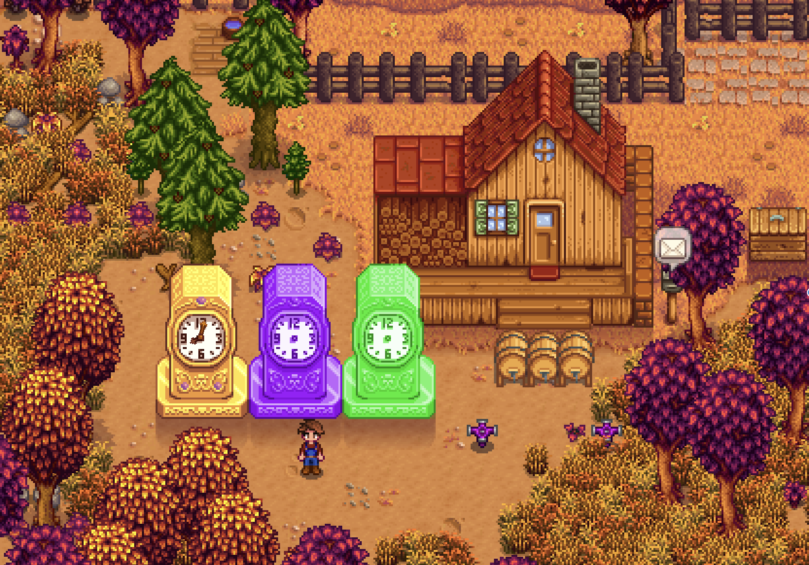

# Stardew Valley Mod: More Clocks

A mod that adds 2 additional Clock buildings to the Wizzard Building Menu as well as adding additional logic to the Gold Clock making it more usable for the end game. All of these additions are aimed for the late end game.

## Installation:
1. Install the latest version of SMAPI
2. Unzip `MoreClocks.zip` into Stardew Valley/Mods.
3. Run the game using SMAPI.

## Compatibility:
- Works with Stardew Valley 1.5 on Linux/Mac/Windows.
- Compatible with SMAPI 3.0+ (untested on earlier versions, but it might still work).
- No known mod conflicts (let me know if you find one).

## How To Use:
1. Run the game using SMAPI.
2. Gold Clock gives you additional 25% more gold for selling items through the Shipping Bin as well as making items sold in the shops cheaper.
3. To unclock the Iridium Clock and Radioactive Clock you must first buy the Gold Clock and have it placed on your farm.
4. Iridium Clock allows you to plant any seeds any season on your farm. It also gives a 25% chance to at the end of each day of Speeding Up all of the machines currently running, meaning their time to finish producing an item is reduced by 25%.
5. Radioactive Clock gives a 25% chance to any crop on your farm (not Greenhouse and Ginger Island) to become Fully Grown overnight. It also increases the chance of getting Giant Crops (Vanilla Crops only) to 25%.
6. Enjoy! 
